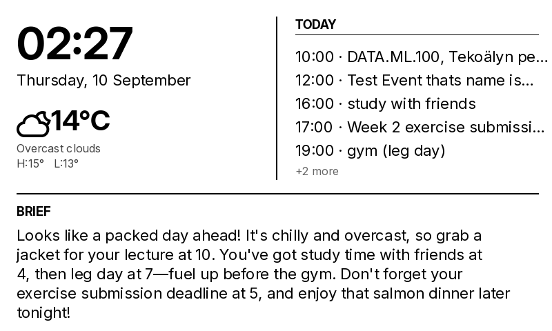

# E-Ink Dashboard

A low-power desk display built around a Raspberry Pi Zero W and a 7.5" e-paper screen. It shows the time, weather, today's schedule, and a short AI-generated daily brief. New events can be added by sending a normal message to a Discord bot, which uses an LLM to turn it into a calendar event.



## Features

* Live weather from OpenWeatherMap with day/night-aware icons
* Merges events from multiple Google Calendars (personal, university course schedule, Moodle deadlines)
* Natural language event creation through a Discord bot ("Dentist tomorrow at 10am")
* LLM-generated daily brief based on the day's weather and events
* Rendering is fully decoupled from hardware, so the layout can be developed and tested as a PNG on any machine

## How it works

```
Discord message -> LLM parser -> validated JSON -> Google Calendar
Google Calendar + Weather API -> LLM brief -> render -> e-paper display
```

| File | Purpose |
|---|---|
| `main.py` | Fetches data, generates the brief, renders the frame |
| `weather.py` | OpenWeatherMap wrapper |
| `calendar_api.py` | Google Calendar read/write (OAuth2) |
| `parser.py` | Natural language to structured event via Claude API |
| `brief.py` | Daily brief generation via Claude API |
| `render.py` | Layout and drawing with Pillow |
| `bot.py` | Discord bot listening in a `#calendar` channel |

## Setup

```bash
python3 -m venv venv
source venv/bin/activate
pip install -r requirements.txt
cp .env.example .env
python3 main.py
```

Requires an OpenWeatherMap key, a Google Cloud OAuth client (`credentials.json`), an Anthropic API key, and a Discord bot token. See `.env.example` for all variables.

## Status

- [x] Weather, calendar and brief rendering
- [x] Discord to calendar pipeline
- [ ] E-paper hardware driver
- [ ] Physical build and deployment on the Pi

## Development notes

Built as a learning project. The core logic (API integrations, event parsing and validation, calendar sync, bot flow, prompt design) was written by me. AI tools were used as a tutor while learning, for debugging help, and for parts of the render layout and this README.

## License

MIT